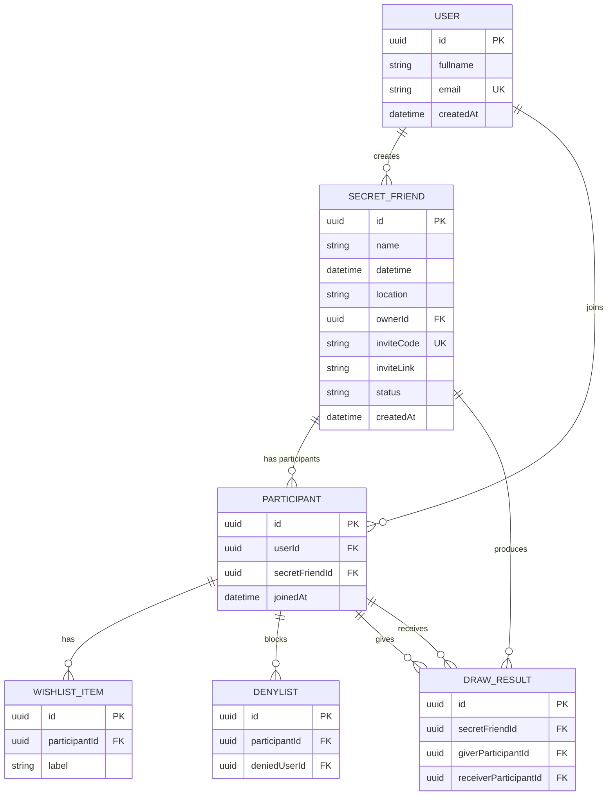

# Casos de uso
A idéia desse sistema é seguir o seguinte fluxo:
- Gerente vai e cria um amigo secreto
    - Possibilidades:
        - ~~nomeia quem vai e tals, põe por email/apelido (algo assim)~~
            - ~~enquanto o gerente vai nomeando, verificamos na base os perfis públicos e já botamos um "já tem conta, nome X"~~
        - ele recebe um código para mandar para todos
        - ele recebe um link gerado para mandar para todos
            - pode ser só uma forma de encapsular o código anterior
- a partir desse link cada um gera uma credencial e acessa os dados de em quais amigos secretos está e o dashboard deles

## Entrada e/ou cadastro no amigo secreto
Com o intuito de realizar um cadastro mais ágil e acelerar o processo de desenvolvimento, nós iremos adotar a abordagem de autenticação via código/nome.

Qualquer pessoa que acessar o link via código poderá executar as seguintes ações
- Logar
    - email
    - ~~senha~~
- Se Cadastrar
    - Nome completo (ou semi)
    - e-mail
## Home
Dentro da página home, nós poderemos ter acesso a um determinado conjunto de dados:
- Amigos secretos em atividade
    - Lista de amigos secretos aos quais faz parte
    - Lista de amigos secretos que criou
- Segunda Tab, histórico de amigos secretos (V2)
    - Amigos secretos anteriores

## Dashboard do Amigo Secreto
Dentro do dashboard, que será exibido ao clicar em um dos amigos secretos que o usuário está presente, será disponibilizadas as seguintes opções:
- acessar a lista de possíveis presentes desejados (wishlist)
- gerenciar o denyList de pessoas
    - Esse denylist tem de exibir as pessoas que já confirmaram a presença no amigo secreto (ao clicar ou resgatar o código do amigo secreto recebido)

Posteriormente, quando for realizado o sorteio do amigo secreto, o usuário poderá acessar seu dashboard, e visualizar quem ele tirou, e as preferencias de presente dessa pessoa.

## Dashboard do Amigo Secreto do Gerente
O gerente, além de usuário, poderá realizar algumas ações específicas para com o amigo secreto criado por ele, essas ações são
- Definir um nome para o amigo secreto
- Definir uma data e horário para a ocorrência do amigo secreto
- Pôr um local para a realização do amigo secreto
- Verificar quantas pessoas já confirmaram que participarão

Após definir todos os dados, e através de uma escolha própria, o gerente do amigo secreto pode:
- Decidir lançar o sorteio naquele momento

### Observações
- O amigo secreto pode ser criado com um formato de rascunho, caso o dia/hora não tenham sido definidos, o status do amigo secreto será de rascunho (`draft`)

### Mecânica de sorteio
O sistema executa o sorteio daquele amigo secreto, e salva o resultado desse sorteio no banco de dados.

Ao fim da execução desse sorteio, é encaminhado um e-mail para cada pessoa sorteada, esse email deve conter:
- Nome da pessoa sorteada
- Lista de desejos dessa pessoa
- Confirmação do local do amigo secreto
- Confirmação do dia/hora do amigo secreto

---

# ✅ **1. Contratos de API (REST)**

## 📌 Convenções Gerais

- Autenticação: `Authorization: Bearer <token>` — token criado ao entrar por código.
- Toda operação vinculada a um _amigo secreto_ exige `secretFriendId` no path.
- Cada usuário identificado por e-mail.

---

# 🔐 **1. Auth**

### **POST /auth/login**

Login via e-mail (sem senha).

```json
Request:
{
  "email": "user@example.com"
}

Response:
{
  "userId": "uuid",
  "token": "jwt-token"
}
```

---

### **POST /auth/register**

```json
Request:
{
  "fullname": "João Silva",
  "email": "user@example.com",
  "inviteCode": "ABC123"   // opcional
}

Response:
{
  "userId": "uuid",
  "token": "jwt-token"
}
```

---

### **POST /auth/enter-by-code**

Quando o usuário abre o link com o código.

```json
Request:
{
  "inviteCode": "ABC123"
}

Response:
{
  "secretFriendId": "uuid",
  "requiresLogin": true
}
```

---

# 🎁 **2. Amigo Secreto – Gerenciamento pelo Gerente**

## **POST /secret-friends**

Criar um amigo secreto.

```json
Request:
{
  "name": "Amigo Secreto da Firma",
  "datetime": "2025-12-20T20:00:00Z", // Opcional
  "location": "Salão de Eventos XYZ", // Opcional
  "maxDenyListSize": 2, // Opcional
}

Response:
{
  "secretFriendId": "uuid",
  "inviteCode": "ABC123",
  "inviteLink": "https://dominio.com/i/ABC123"
}
```

---

## **GET /secret-friends/{id}**

Detalhes gerais.

```json
Response:
{
  "id":"uuid",
  "name":"Amigo Secreto da Firma",
  "datetime":"2025-12-20T20:00:00Z",
  "location":"Salão XYZ",
  "ownerId":"uuid",
  "participantsCount": 12,
  "status": "draft | open | drawn | closed"
}
```

---

## **PATCH /secret-friends/{id}**

Gerente edita dados.

```json
Request:
{
  "name": "Novo nome",
  "datetime":"2025-12-22T20:00:00Z",
  "location":"Novo local"
}
```

---

## **POST /secret-friends/{id}/draw**

Executa o sorteio.

```json
Response:
{
  "secretFriendId":"uuid",
  "status":"drawn",
  "resultCount": 12
}
```

---

# 👥 **3. Participantes**

## **POST /secret-friends/{id}/participants**

Confirmar participação no amigo secreto.

```json
Request:
Authorization: Bearer {token} // Já possui o userId
{
  "confirm": false // required; Informa se a ação é de entrar ou sair do evento
}

Response:
{
  "success": true,
  "participantId": "uuid"
}
```

---

## **GET /secret-friends/{id}/participants**

Lista de participantes confirmados.

```json
Response:
[
  { "participantId":"uuid", "userId":"uuid", "fullname":"Maria" }
]
```

---

# 📜 **4. Wishlist**

## **GET /secret-friends/{id}/wishlist**

Retorna a própria wishlist.

```json
[
  { "itemId":"uuid", "label":"Livro X", "comments": "text about why I want this item, buy it at https://amazon.com/" },
  { "itemId":"uuid", "label":"Jogo Steam" }
]
```

## **POST /secret-friends/{id}/wishlist**

```json
Request:
{
  "label": "Bala de menta gigante",
  "comments": "Eu quero que todos sintam meu hálito saboroso"
}
```

## **DELETE /secret-friends/{id}/wishlist/{itemId}**

---

# ❌ **5. DenyList**

## **GET /secret-friends/{id}/denylist**

Retorna quem o usuário não quer tirar.

---

## **POST /secret-friends/{id}/denylist**

```json
Request:
{
  "targetUserId": "uuid"
}
```

## **DELETE /secret-friends/{id}/denylist/{targetUserId}**

---

# 🎯 **6. Resultado do Sorteio**

## **GET /secret-friends/{id}/draw-result**

Retorna quem o usuário tirou.

```json
Response:
{
  "targetUserId":"uuid",
  "targetName":"Fulano",
  "wishlist":[...]
}
```

---

# 🏠 **7. Dashboard / Home**

## **GET /dashboard**

Retorna tudo relevante do usuário.

```json
Response:
{
  "activeCreated": [...], // Lista de eventos ativos que gerencia
  "activeParticipant": [...], // Lista de eventos ativos que participa
}
```

---

# 🗂 **8. Sistema de Convite**

## **GET /invites/{code}**

Retorna informações sobre o amigo secreto pelo código do link.

```json
{
  "secretFriendId":"uuid",
  "name":"Amigo Secreto da Firma"
}
```

---

# 🧬 **2. Modelo ER do Banco de Dados (Mermaid)**



