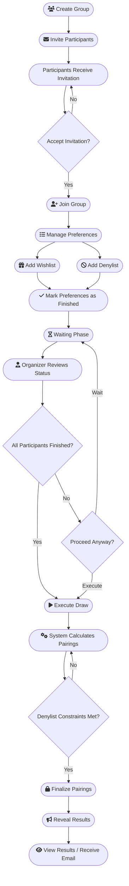

# User Flow

This document details the flow of using the API to manage a Secret Friend (Secret Santa) game.

1. **Create Group**: A user creates a new Secret Friend group/event.
2. **Invite Participants**: The creator (or authorized members) invites other people to join the group.
3. **Accept Invitation**: The invited persons accept the invitation to join the group.
4. **Manage Preferences**:
    * **Wishlist**: Participants add items they would like to receive (up to a maximum capacity).
    * **Denylist**: Participants add valid peers they *cannot* or *do not want to* be paired with (up to a maximum
      capacity). Users cannot deny themselves or non-participants.
    * **Finalize**: Participants explicitly mark their preferences as finished.
5. **The Draw**:
    * The person in charge requests the draw to be performed.
    * The system calculates the pairings, respecting denylists.
6. **Results**: The results of the draw are effectively sent/revealed to every participant (e.g., via email or creating
   a viewable result for them).

